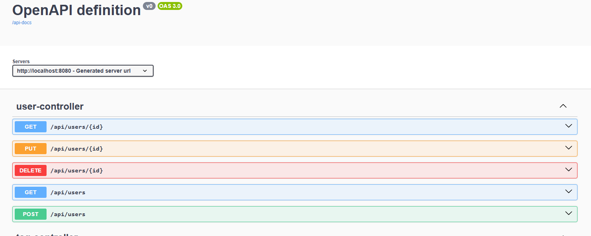
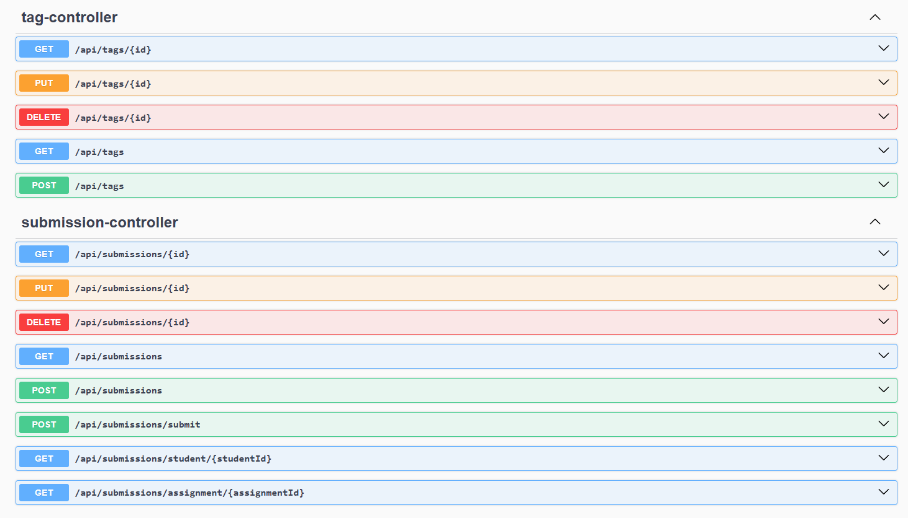
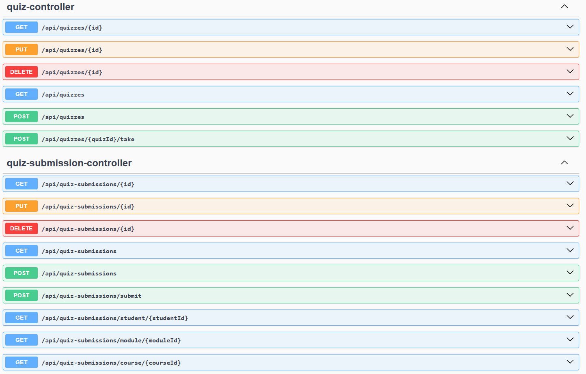
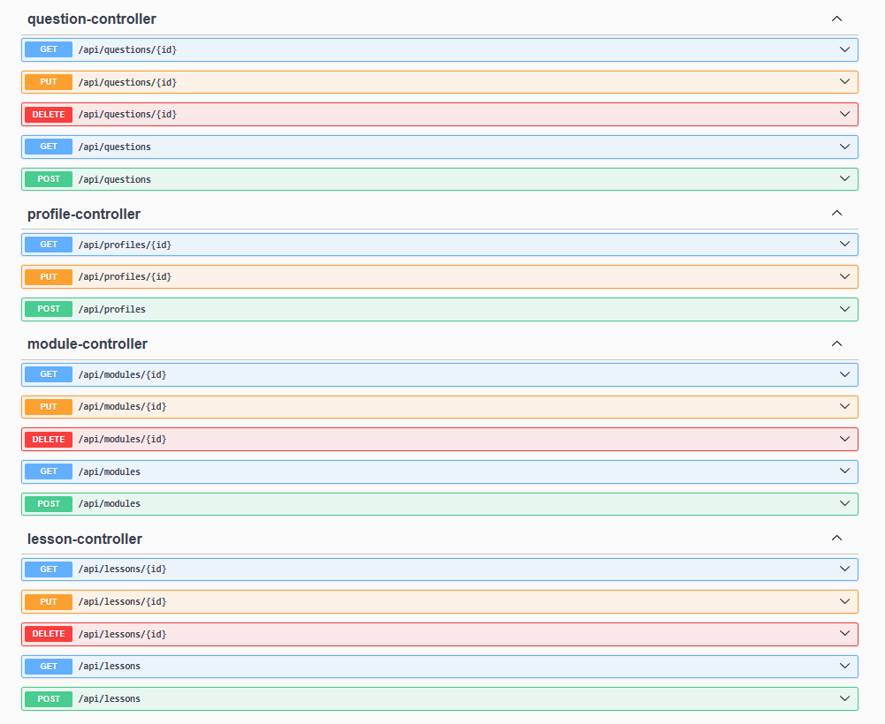
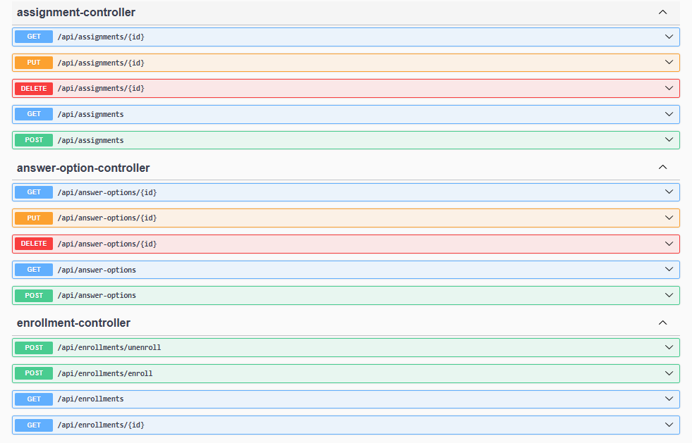
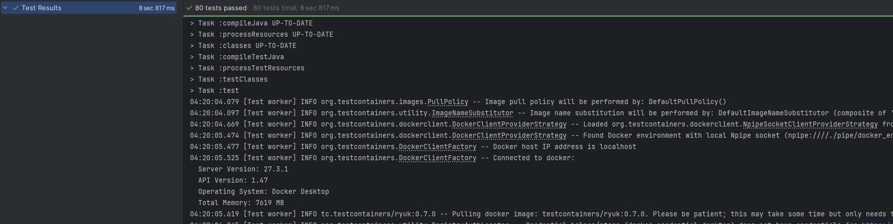

# SFOrm-Proj
---

## Переменные

```bash
DB_HOST=db
DB_PORT=5432
DB_NAME=sf_orm
DB_USERNAME=postgres
DB_PASSWORD=postgres
```
---

## Быстрый старт с Gradle

### Сборка проекта

```bash
./gradlew build
```
---

### Запуск тестов
* **Все тесты с профилем `test` (PostgreSQL):**

```bash
./gradlew test -Dspring.profiles.active=test
```

* **С профилем `testh2` (H2 in-memory):**

```bash
./gradlew test -Dspring.profiles.active=testh2
```
---

## Разворачивание с Docker

```bash
cd orm-proj
./gradlew build -x test
docker-compose up -d
```

Тестировать API можно с помощью Swagger
http://localhost:8080/swagger-ui/index.html






---

## Тестирование и CI

* Unit и интеграционные тесты настроены для PostgreSQL и H2

---
